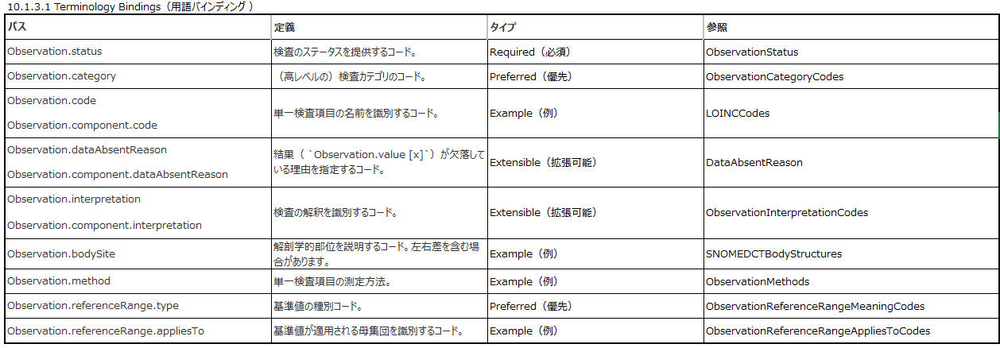

# 10.1 Observation まとめメモ
## 10.1.1 範囲と使用法
- Observation リソースは**臨床検査、画像検査などの観察データ
TerminologyBindings.jpg
- DiagnosticReportリソースに参照されることで、レポートとなる。
- 主な用途（※ちなみに下記例は後述する例に良く登場するので、例による理解は10.1.4以降を見た方が良い）
  - 体重・血圧・体温などのバイタルサイン
  - 血糖値、推定GFRなどの検査データ
  - 骨密度、胎児測定などの画像検査結果
  - 腹部圧痛などの臨床所見
  - EKGデータ、パルスオキシメーターデータなどのデバイス測定値
  - APGARやGlasgow Coma Scale(GCS)などの臨床評価ツール
  - 眼の色などの個人特性
  - 喫煙歴、家族支援、認知状態などの社会歴
  - 妊娠状態、死亡判定などのコア特性
## 10.1.2 境界と関係
割愛
## 10.1.3 リソース内容
※Structureは割愛

## 10.1.4 注釈
- 検査プロファイリング (10.1.4.1)
  - もっともシンプルな例は、**コード＋値＋ステータスフラグ＝リソースインスタンス**
  - ただし、事例によっては、追加の制約や情報が必要となるので、**他のリソース同様、拡張が可能**
- 検査対象 (10.1.4.2)
  - 対象＝患者 or 患者グループ or 部位 or 機器
  - 対象には**３つの属性**がある
    - specimen（検体）・・・検体サンプル
    - bodySite（検査部位）・・・解剖学・形態学的な部位
    - focus(注意点) ・・・患者埋め込み機器など特定の対象
- 検査グループ化 (10.1.4.3 )
  - 多くの場合、グループ化が必要（下記）
    - DiagnosticReport.result（検査報告書.結果）　→　10.1.4.3.1
      - DiagnosticReport.code = グループ化要素（パネル、バッテリーに相当）
      - DiagnosticReport.result = 個々の検査値
    - Observation.component（検査.要素）　→　10.1.4.3.2
    - Observation.hasMember（検査.保持メンバ）　→　10.1.4.3.3
    - Observation.derivedFrom（検査.派生元）　→　10.1.4.3.3
- コード利用 (10.1.4.4)
  - valueCodeableConceptを利用
  - SNOMED_CTなど利用を推奨
  - 複数のコーディング
    - ConceptMapリソースを使用してマッピング
    - 他にも、直接追加のコーディング
  - フリーテキストも利用できる(10.1.4.4.2)
    - valueCodeableConcept.text 要素を利用。その他の概念コードも利用できる。 
  - 相互運用性の問題
    - observation.code と observation.value の設定方法を決定する。
    - 問題は同じ情報を表すいくつかの異なる方法が存在。
    - FHIRを実装する組織やドメインによって指定されたプロファイルおよび実装ガイドを通じて行われることが期待される
    - 例えば、同じ腹部圧痛を表す表現形式が４つある。例を参照
  - ガイドライン
    - Observation.code はLOINCが望ましい。
    - 非数値の場合、Observation.value はSNOMED-CTが望ましい
  - 追加コードなどによる洗練
    - 具体的なコードを使用するように
    - そのために、追加コードを利用。（血中グルコースに対して、食後2時間とい情報追加とか）
    - 検査は通常、グループ化。検査を正しく理解および解釈するために必要な追加情報を提供。適宜、拡張機能を利用するように。
  - value[x] とデータ型
    - [x]は複数のデータ型をサポートすることを表す
    - データ型に応じたさまざまな変数名がある（列挙）
